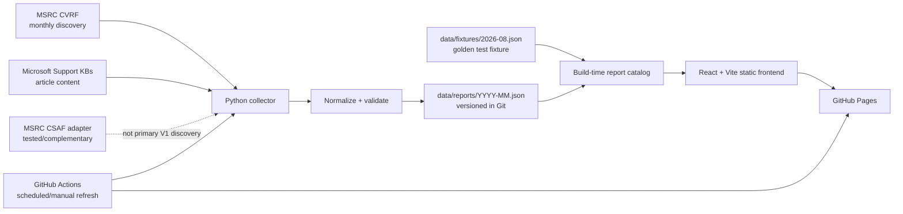

# Windows Patch Dashboard

`PROJECT.md` is the primary 80/20 context for the current repository. It describes what the project is and how the verified implementation works. For rationale, read `DECISIONS.md`; for agent behavior, read `AGENTS.md`; for commands and operations, read `RUNBOOK.md`.

## Purpose

Windows Patch Dashboard turns official Microsoft Patch Tuesday information into a compact monthly report for infrastructure, security, DevOps, sysadmin, patch-management, vulnerability-management, and IT operations users.

It provides:

- Windows Server 2012/2012 R2 ESU and newer Windows Server coverage defined by the data contract;
- supported Windows 11 branches represented for a report month;
- KB, OS, key changes, resolved issues, and known issues in five canonical report columns;
- official-source provenance for generated production records;
- interactive filtering, Report Mode, and client-side PNG export.

It does **not** provide device inventory, patch compliance, authentication/accounts, a vulnerability-management backend, a database-backed API, or runtime AI analysis.

## Current Architecture

The browser does not call Microsoft. Collection happens in Python locally or in GitHub Actions. The frontend consumes validated JSON bundled at build time.

## Data Flow

1. A strict `YYYY-MM` report month is selected. Automation chooses the latest month whose second Tuesday has already occurred when no month is supplied.
2. The collector retrieves the monthly MSRC CVRF document and maps supported Microsoft product names to normalized OS identities.
3. Each discovered KB is verified against official Microsoft Support. `es-ES` content is preferred; `en-US` is the fallback when Spanish content cannot be retrieved and parsed reliably.
4. Microsoft Support provides deterministic article content for changes, fixes, and known issues. Hotpatch exclusions require an official Support redirect under Microsoft's `/hotpatch/` path.
5. Normalization applies product rules, canonical ordering, provenance, known-issue semantics, `NO PUBLICADO` behavior for missing 2012/2012 R2 ESU monthly rollups, conservative OOB handling, and fail-safe conflict checks.
6. The report is schema/semantics validated and atomically written to `data/reports/YYYY-MM.json`. An existing report is preserved if collection or validation fails.
7. Scheduled/manual automation compares the generated report with the committed report while ignoring only `generatedAt` and source `retrievedAt`. Only substantive changes are committed.
8. Vite imports `data/fixtures/*.json` and `data/reports/*.json` at build time. A production report overrides a same-month fixture.
9. GitHub Pages serves the resulting static React application.

## Repository Structure

| Path | Responsibility |
| --- | --- |
| `collector/` | Python package, Microsoft source adapters, normalization, validation, automation helpers, and pytest tests. |
| `frontend/` | React/Vite/TypeScript UI, local report loader, filtering, Report Mode, PNG export, and Vitest tests. |
| `data/schema/` | JSON Schema contract for monthly reports. |
| `data/reports/` | Generated/versioned production report JSON. |
| `data/fixtures/` | Test fixtures; `2026-08.json` is the manual golden fixture. |
| `.github/workflows/` | CI plus report refresh and GitHub Pages deployment. |
| `docs/` | Historical/phase-specific design and source-evaluation documentation. |
| `design/` | Visual design reference and Phase 2 design notes. |
| `third_party/` | Third-party license material. |

## Technology Stack

- Python package requirement: `>=3.11`; GitHub Actions and the current README use Python 3.12.
- `httpx`, BeautifulSoup, `lxml`, `jsonschema`.
- pytest, Ruff, mypy.
- React 19, TypeScript 5.9, Vite 7.
- Vitest, Testing Library, ESLint, Prettier.
- `html-to-image` for browser-side PNG export.
- GitHub Actions for CI, refresh, and deployment orchestration.
- GitHub Pages for static hosting.

## Current Features

- Monthly report catalog derived from bundled fixture/report JSON.
- Newest available month selected by default; users can switch among bundled months.
- Individual OS selection with canonical report ordering.
- Five canonical report columns.
- Known-issue status labels: `none`, `open`, `resolved`, `not-published`, `unknown`.
- OOB supersedence displayed independently from known-issue state.
- Official source links in Interactive Mode.
- Light/dark theme with system preference and persisted explicit choice.
- Report Mode optimized for a dense shareable artifact.
- High-resolution client-side PNG export of the filtered report.
- Daily/manual report refresh and semantic change detection.

## Current State

- `main` is the default branch.
- `data/reports/2026-08.json` is the currently committed production report.
- `data/fixtures/2026-08.json` is the manual golden fixture; the production report takes precedence for the same month.
- The committed August production report currently has status `partial`, meaning collection succeeded but at least one item remained incomplete/ambiguous according to collector rules.
- `.github/workflows/pages.yml` is active for pushes to `main`, daily schedule, and manual dispatch. Recent inspected scheduled runs completed successfully.
- The public project URL encoded in the frontend is `https://f4cus.github.io/windows-patch-dashboard/`.

## Known Limitations / Technical Debt

- V1 monthly discovery depends on CVRF; there is no automatic bulk-CSAF fallback.
- CSAF parsing exists and is tested, but it is complementary and is not used by the production monthly collection path.
- Microsoft Support extraction depends on recognizable article structure. Unverifiable known-issue evidence remains `unknown` rather than being guessed.
- OOB discovery is intentionally conservative and requires explicit official structured evidence.
- Only one unique report month is currently committed, so the month selector has no historical choice until more report JSON files are added.
- The report contract is validated both in Python and again by the TypeScript loader. This is useful defense in depth but creates contract-sync maintenance work.
- `frontend` has Vitest tests, but the current `ci.yml` frontend job does not run `npm test`; agents must run it locally until CI is aligned.
- Historical docs contain some Phase-specific statements that no longer match the current UI/source behavior; use the root harness files and current code/workflows as the operational context.

## Sources of Truth

| Concern | Source of truth |
| --- | --- |
| Monthly data contract | `data/schema/monthly-report.schema.json` plus semantic checks in `collector/src/windows_patch_collector/validation.py` |
| Production data | `data/reports/*.json` |
| Golden test data | `data/fixtures/2026-08.json` |
| Product aliases/order | `collector/src/windows_patch_collector/products.py`, `ordering.py` |
| Microsoft collection | `collector/src/windows_patch_collector/` and `sources/` |
| Atomic output / semantic refresh | `collector/src/windows_patch_collector/output.py`, `automation.py` |
| Frontend data model/loading | `frontend/src/data/model.ts`, `loadMonthlyReport.ts`, `reportCatalog.ts` |
| UI behavior | `frontend/src/` and its tests |
| CI | `.github/workflows/ci.yml` |
| Refresh / Pages deployment | `.github/workflows/pages.yml`, `frontend/vite.config.js` |
| Active technical decisions | `DECISIONS.md` |
| Historical Phase rationale | `docs/decisions.md`, `docs/phase-3-*.md` |
